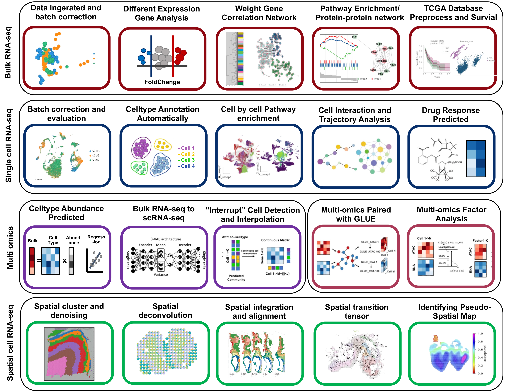

<h1 align="center">

</h1><br>

[](https://www.tidyverse.org/lifecycle/#maturing) [](https://img.shields.io/appveyor/build/gruntjs/grunt) [](https://img.shields.io/apm/l/vim-mode) [](https://pypi.org/project/omicverse) [](https://omicverse.readthedocs.io/en/latest/?badge=latest) [](https://github.com/Starlitnightly/omicverse/workflows/CodeQL/badge.svg) [](https://github.com/Starlitnightly/omicverse/)

OmicVerse is the fundamental package for multi omics included bulk and single cell analysis with Python. For more information, please read our paper: [OmicVerse: A single pipeline for exploring the entire transcriptome universe](https://www.biorxiv.org/content/10.1101/2023.06.06.543913v1)

The original name of the omicverse was [Pyomic](https://pypi.org/project/Pyomic/), but we wanted to address a whole universe of transcriptomics, so we changed the name to OmicVerse, it aimed to solve all task in RNA-seq.

BulkTrajBlend algorithm in OmicVerse that combines Beta-Variational AutoEncoder for deconvolution and graph neural networks for overlapping community discovery to effectively interpolate and restore the continuity of “interrupted” cells in the original scRNA-seq data.



## Directory structure

````shell
.
├── omicverse                  # Main Python package
├── omicverse_guide            # Documentation files
├── sample                     # Some test data
├── LICENSE
└── README.md
````

## Where to get it

OmicVerse can be installed via conda or pypi and you need to install `pytorch` at first. Please refer to the [installation tutorial](https://omicverse.readthedocs.io/en/stable/Installation_guild/) for more detailed installation steps and adaptations for different platforms (`Windows`, `Linux` or `Mac OS`).

You can use `conda install omicverse -c conda-forge` or `pip install -U omicverse` for installation.

## Usage

Please checkout the documentations and tutorials at [omicverse.readthedocs.io](https://omicverse.readthedocs.io/en/latest/index.html).

## Data Framework

- [pandas](https://github.com/pandas-dev/pandas)
- [anndata](https://github.com/scverse/anndata)
- [numpy](https://github.com/numpy/numpy)
- [mudata](https://github.com/scverse/mudata)

## Reference

- [1] [Scanpy](https://github.com/scverse/scanpy) was originally published in [*Genome biology*](https://link.springer.com/article/10.1186/s13059-017-1382-0)
- [2] [dynamicTreeCut](https://github.com/kylessmith/dynamicTreeCut) was originally published in [*Bioinformatics*](https://academic.oup.com/bioinformatics/article/24/5/719/200751) 
- [3] [scDrug](https://github.com/ailabstw/scDrug) was originally published in [*Computational and Structural Biotechnology Journal*](https://www.sciencedirect.com/science/article/pii/S2001037022005505)
- [4] [MOFA](https://github.com/bioFAM/mofapy2) was originally published in [*Genome Biology*](https://genomebiology.biomedcentral.com/articles/10.1186/s13059-020-02015-1)
- [5] [COSG](https://github.com/genecell/COSG) was originally published in [*Briefings in Bioinformatics*](https://academic.oup.com/bib/advance-article-abstract/doi/10.1093/bib/bbab579/6511197?redirectedFrom=fulltext)
- [6] [CellphoneDB](https://github.com/ventolab/CellphoneDB) was originally published in [*Nature*](https://www.nature.com/articles/s41586-018-0698-6)
- [7] [AUCell](https://github.com/aertslab/AUCell) was originally available in [*Bioconductor*](https://bioconductor.org/packages/AUCell), and we use the script of Pyscenic to instead.
- [8] [Bulk2Space](https://github.com/ZJUFanLab/bulk2space) was originally published in [*Nature Communications*](https://www.nature.com/articles/s41467-022-34271-z)
- [9] [SCSA](https://github.com/bioinfo-ibms-pumc/SCSA) was originally published in [*Front Genet*](https://doi.org/10.3389/fgene.2020.00490)
- [10] [WGCNA](http://www.genetics.ucla.edu/labs/horvath/CoexpressionNetwork/Rpackages/WGCNA) was originally avaliable in [*BMC Bioinformatics*](https://bmcbioinformatics.biomedcentral.com/articles/10.1186/1471-2105-9-559)
- [11] [VIA](https://github.com/ShobiStassen/VIA) was originally published in [*Nature Communications*](https://www.nature.com/articles/s41467-021-25773-3)
- [12] [pyDEseq2](https://github.com/owkin/PyDESeq2) was originally published in [*biorxiv*](https://www.biorxiv.org/content/10.1101/2022.12.14.520412v1)
- [13] [NOCD](https://github.com/shchur/overlapping-community-detection) was originally avaliable in [*Deep Learning on Graphs Workshop, KDD*](https://arxiv.org/abs/1909.12201)
- [14] [SIMBA](https://github.com/pinellolab/simba) was originally published in [*Nature Methods*](https://www.nature.com/articles/s41592-023-01899-8)
- [15] [GLUE](https://github.com/gao-lab/GLUE) was originally published in [*Nature Biotechnology*](https://www.nature.com/articles/s41587-022-01284-4)
- [16] [MetaTiME](https://github.com/yi-zhang/MetaTiME) was originally published in [*Nature Communications*](https://www.nature.com/articles/s41467-023-38333-8)
- [17] [TOSICA](https://github.com/JackieHanLab/TOSICA) was originally published in [*Nature Communications*](https://doi.org/10.1038/s41467-023-35923-4)
- [18] [Harmony](https://github.com/slowkow/harmonypy/) was originally published in [*Nature Methods*](https://www.nature.com/articles/s41592-019-0619-0)
- [19] [Scanorama](https://github.com/brianhie/scanorama) was originally published in [*Nature Biotechnology*](https://www.nature.com/articles/s41587-019-0113-3)
- [20] [Combat](https://github.com/epigenelabs/pyComBat/) was originally published in [*biorxiv*](https://doi.org/10.1101/2020.03.17.995431)


## Included Package not published or preprint

- [1] [Cellula](https://github.com/andrecossa5/Cellula/) is to provide a toolkit for the exploration of scRNA-seq. These tools perform common single-cell analysis tasks
- [2] [pegasus](https://github.com/lilab-bcb/pegasus/) is a tool for analyzing transcriptomes of millions of single cells. It is a command line tool, a python package and a base for Cloud-based analysis workflows.

## Contact

- Zehua Zeng ([starlitnightly@163.com](mailto:starlitnightly@163.com) or [zehuazeng@xs.ustb.edu.cn](mailto:zehuazeng@xs.ustb.edu.cn))
- Lei Hu ([hulei@westlake.edu.cn](mailto:hulei@westlake.edu.cn))

## Developer Guild

If you would like to contribute to omicverse, please refer to our [developer documentation](https://omicverse.readthedocs.io/en/latest/Developer_guild/).

## Acknowledgements

We would like to thank the following WeChat Official Accounts for promoting Omicverse.

<p align="left"> <a href="http://www.biotrainee.com/" target="_blank" rel="noreferrer">  </a> <a href="https://zhuanlan.zhihu.com/c_1257815636945915904?page=3" target="_blank" rel="noreferrer">  </a> </p>

## Other

<div>Logo made by <a href="https://www.designevo.com/" title="Free Online Logo Maker">DesignEvo free logo creator</a></div>

