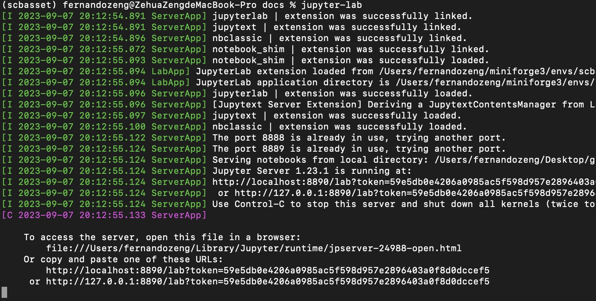

# Installation

## Prerequisites


OmicVerse can be installed via conda or pypi and you need to install `pytorch` at first

!!! note 
    To avoid potential dependency conflicts, installing within a `conda` environment is recommended. And using `pip install -U omicverse` to update.

### Platform

In different platform, there are some differences in the most appropriate installation method.

- `Windows`: You need to install the [`wsl` subsystem](https://learn.microsoft.com/en-us/windows/wsl/install) and `conda` in the wsl subsystem to configure the omicverse environment.
- `Linux`: We can choose to install [anaconda](https://www.anaconda.com/) or [miniconda](https://docs.conda.io/en/latest/miniconda.html), and then use conda to configure the omicverse environment
- `Mac Os`: We recommend using [`miniforge`](https://github.com/conda-forge/miniforge)  or [`mambaforge`](https://www.rho-signal-effective-analytics.com/modules/pre-course/miniconda-installation/)to configure.

### pip prerequisites
- If using conda/mamba, then just run `conda install -c anaconda pip` and skip this section.
- Install Python, we prefer the pyenv version management system, along with pyenv-virtualenv.

### Apple silicon prerequisites
Installing omicverse on a Mac with Apple Silicon is only possible using a native version of python. A native version of python can be installed with an Apple Silicon version of mambaforge (which can be installed from a native version of homebrew via `brew install --cask mambaforge`). 

## Conda

### 1.  Install conda. We typically use the `mambaforge` distribution. Use python>=3.8, conda consider using mamba instead of conda.
### 2.  Create a new conda environment: 

   ```shell
   conda create -n omicverse python=3.8
   ```
### 3.  Activate your environment:

   ```shell
   conda activate omicverse
   ```
### 4.  Install [PyTorch](https://pytorch.org/get-started/locally/) at first:

   ```shell
   conda install pytorch torchvision torchaudio pytorch-cuda=11.7 -c pytorch -c nvidia
   ```
### 5.  Install `omicverse`:

   ```shell
   conda install omicverse -c conda-forge
   ```

## Pip

The `omicverse` package can be installed via pip using one of the following commands:

### 1. Install [PyTorch](https://pytorch.org/get-started/locally/) at first: More about the installation can be found at [PyTorch](https://pytorch.org/get-started/locally/). 

   ```shell
   # ROCM 5.2 (Linux only)
   pip3 install torch torchvision torchaudio --extra-index-url
   pip install torch==1.13.1+rocm5.2 torchvision==0.14.1+rocm5.2 torchaudio==0.13.1 --extra-index-url https://download.pytorch.org/whl/rocm5.2
   # CUDA 11.6
   pip install torch==1.13.1+cu116 torchvision==0.14.1+cu116 torchaudio==0.13.1 --extra-index-url https://download.pytorch.org/whl/cu116
   # CUDA 11.7
   pip install torch==1.13.1+cu117 torchvision==0.14.1+cu117 torchaudio==0.13.1 --extra-index-url https://download.pytorch.org/whl/cu117
   # CPU only
   pip install torch==1.13.1+cpu torchvision==0.14.1+cpu torchaudio==0.13.1 --extra-index-url https://download.pytorch.org/whl/cpu
   ```

### 2. You need to configure the gcc to install some package
   ```shell
   #ubuntu
   sudo apt update
   #install build-essential
   sudo apt install build-essential
   ```

   ```shell
   #centos
   sudo yum group install "Development Tools"
   ```

   if you can see the version of gcc, it means the success of installation

   ```shell
   gcc --version
   ```


### 3. After the installation of pytorch, we can start to install `omicverse` by `pip`


!!! Warning 
    If you live in mainland China, you can try adding -i after pip https://pypi.tuna.tsinghua.edu.cn/simple. Likes, `pip install -U omicverse -i https://pypi.tuna.tsinghua.edu.cn/simple`

   ```shell
   pip install -U omicverse
   pip install -U numba
   ```
### 4. If you want to using Nightly verseion. There are two ways for you to install

   - Nightly version - clone this [repo](https://github.com/Starlitnightly/omicverse) and run: `pip install .`
   - Using `pip install git+https://github.com/Starlitnightly/omicverse.git`

## Others

!!! Warning 
    If you're getting errors with pip, then for packages that pip can't install, such as scikit-misc, you can use `conda install scikit-misc -c conda-forge -c bioconda` to install them, and then continue to use pip to install the original packages after that

if you using M1/M2 silicon, perhaps the following code will be helped:

```shell
#python 3.9
conda install s_gd2 -c conda-forge
pip install -U omicverse 
conda install pytorch::pytorch torchvision torchaudio -c pytorch
```

## Jupyter-lab

For the best interactive analysis experience, we highly recommend installing jupyter-lab so that you can interactively edit the code and get the analysis results and visualizations right away.

```shell
pip install jupyter-lab
```

After you have finished the installation, in your terminal (note that you must be in the omicverse environment, not the base environment), type `jupyter-lab`, a URL will appear, we can open this URL in the browser to start our analysis journey!




## Development

For development - clone this repo and run:

```shell
pip install -e ".[dev,docs]"
```

